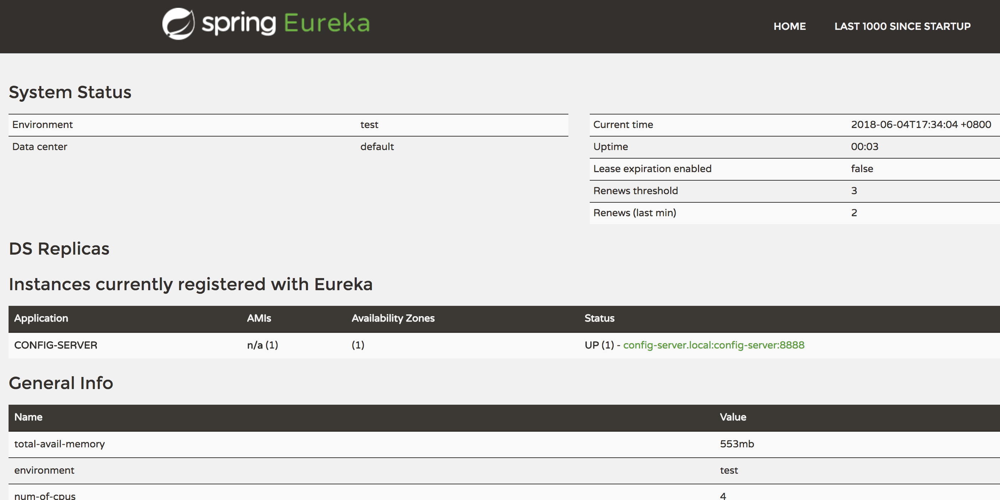
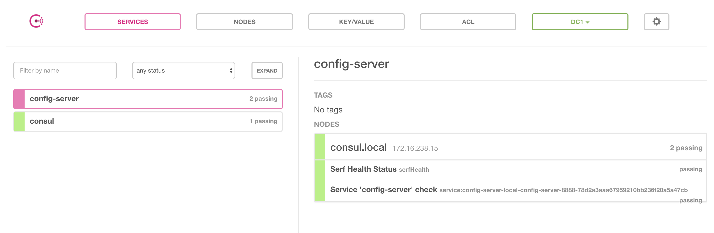
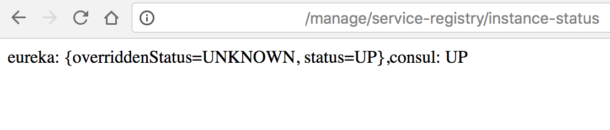
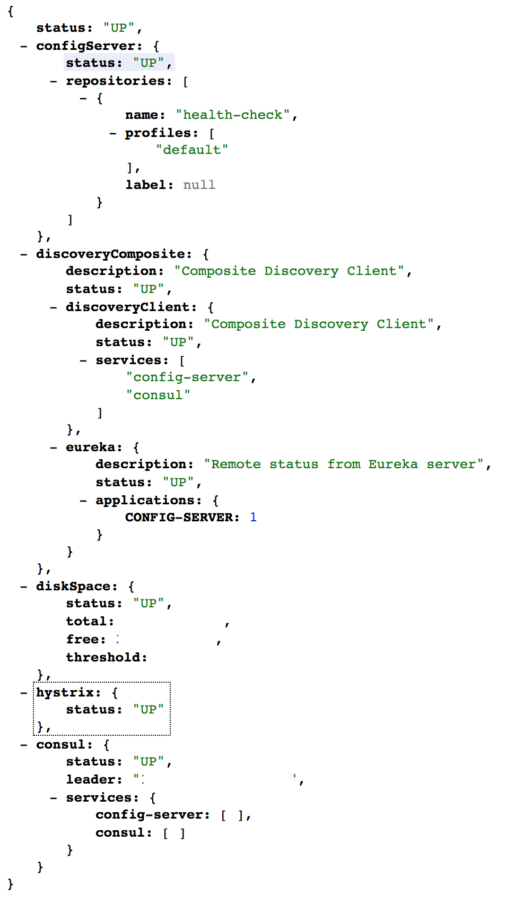
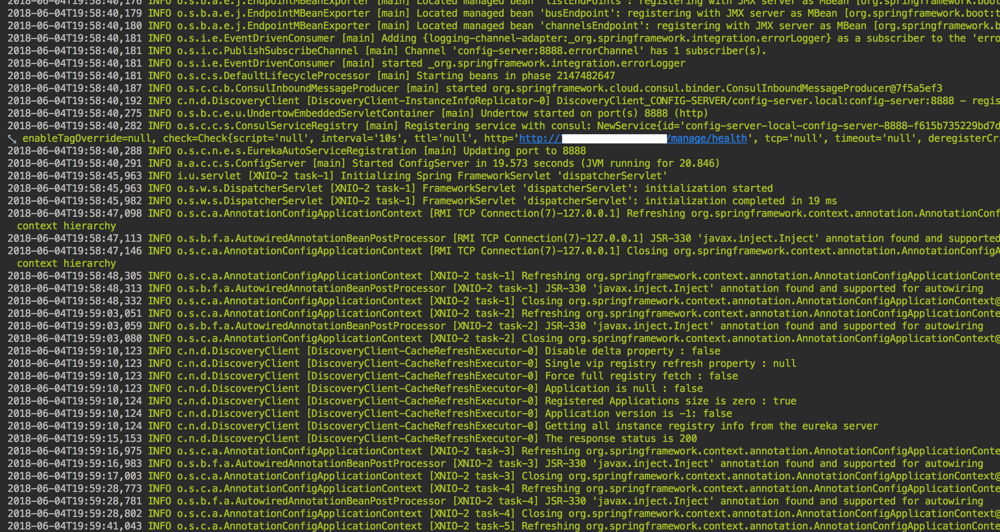

# spring-cloud-multi-registration
spring-cloud-multi-registration

## Register service instance onto multiple service registries at same time

Tested with `spring-cloud-netflix-eureka-client` and `spring-cloud-consul-discovery`

Both eureka and consul are registered without runtime exception.


## Enable Multi service registration

Dependencies in pom.xml
```xml
<dependencies>
  <!-- @formatter:off -->
    <dependency><groupId>org.springframework.cloud</groupId><artifactId>spring-cloud-starter-eureka</artifactId></dependency>
    <dependency><groupId>org.springframework.cloud</groupId><artifactId>spring-cloud-starter-consul-all</artifactId></dependency>
    <dependency><groupId>org.springframework.boot</groupId><artifactId>spring-boot-starter-actuator</artifactId><scope>runtime</scope></dependency>
  <!-- @formatter:on -->
</dependencies>
```

Use `@EnableDiscoveryClient` on top of you *Application.class

In bootstrap.yml config consul host/port
```yaml
spring:
  application:
    name: ${SPRING_APPLICATION_NAME:application}
  cloud:
    config:
      enabled: false
    consul:
      host: ${SPRING_CLOUD_CONSUL_HOST:consul.local}
      port: ${SPRING_CLOUD_CONSUL_PORT:8500}
```

In application.yml config consul and eureka as normal and here is the key different to default situation.
```yaml
spring.autoconfigure.exclude:
- org.springframework.cloud.client.serviceregistry.ServiceRegistryAutoConfiguration
- org.springframework.cloud.client.serviceregistry.AutoServiceRegistrationAutoConfiguration

spring:
  cloud:
    service-registry:
      # see: org.springframework.cloud.client.serviceregistry.AutoServiceRegistrationAutoConfiguration
      auto-registration:
        enabled: true
        fail-fast: true
      # custom property
      auto-multi-registration.enabled: true
```

## Screenshots

1. Eureka



2. Consul



3. instance-status endpoint



4. health endpoint



5. Instance log



## Default single service registration

see: org.springframework.cloud.client.serviceregistry.ServiceRegistryAutoConfiguration

see: org.springframework.cloud.client.serviceregistry.AutoServiceRegistrationAutoConfiguration
